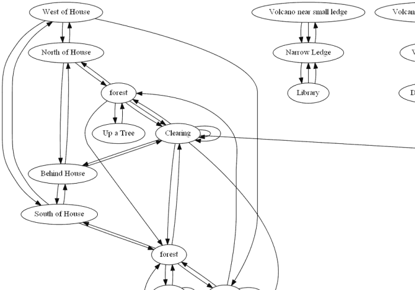
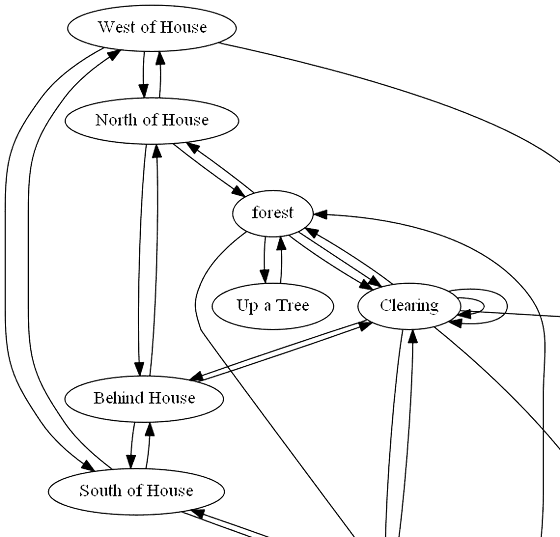

# Lantern

Lantern is an exploration of **[Zork: The Great Underground Empire][zork]**, or at least as
it existed in 1978 in the original Muddle code.

The game looked like this -

```
ZORK I: The Great Underground Empire
Copyright (c) 1981, 1982, 1983 Infocom, Inc. All rights reserved.
ZORK is a registered trademark of Infocom, Inc.
Revision 88 / Serial number 840726

West of House
You are standing in an open field west of a white house, with a boarded front door.
There is a small mailbox here.

> open mailbox
Opening the small mailbox reveals a leaflet.

> read leaflet
(Taken)

"WELCOME TO ZORK!
ZORK is a game of adventure, danger, and low cunning. In it you will explore
some of the most amazing territory ever seen by mortals. No computer should be
without one!"
```

## Muddle Source Code

It was written in [MDL (aka Muddle)](muddle), a dialect of Lisp from the 1970's. The code
looks like this -

```lisp
<DEFINE CLEARING ("AUX" (GRATE <SFIND-OBJ "GRATE">) (LEAVES <SFIND-OBJ "LEAVE">))
  #DECL ((LEAVES GRATE) OBJECT)
  <COND (<VERB? "LOOK">
    <TELL
"You are in a clearing, with a forest surrounding you on the west
and south.">
    <COND (<TRNN .GRATE ,OPENBIT>
     <TELL "There is an open grating, descending into darkness." 1>)
          (,GRATE-REVEALED!-FLAG
     <TELL "There is a grating securely fastened into the ground." 1>)>)>>

<ROOM "WHOUS"
"This is an open field west of a white house, with a boarded front door."
       "West of House"
       <EXIT "NORTH" "NHOUS" "SOUTH" "SHOUS" "WEST" "FORE1"
	      "EAST" #NEXIT "The door is locked, and there is evidently no key.">
       (<GET-OBJ "FDOOR"> <GET-OBJ "MAILB"> <GET-OBJ "MAT">)
       <>
       <+ ,RLANDBIT ,RLIGHTBIT ,RNWALLBIT ,RSACREDBIT>
       (RGLOBAL ,HOUSEBIT)>
```

## A Nicer Lisp

Which with a little text manipulation can be converted to a more parsable Lisp. There
are some constructs like `#NEXIT` and the `#DECL` type declarations which would need
special handling, but we can filter them out for now.

There are also conditional exits, which look like
`("SOUTH" (cexit "CYCLOPS-FLAG" "TREAS" "The cyclops doesn't look like he'll let you past."))`,
and doorways, which look like `("UP" (door "DOOR" "LROOM" "CELLA"))`, from which
we can extract the destination.

So we get some room structures like so -

```lisp
(room "WHOUS"
    "This is an open field west of a white house, with a boarded front door."
    "West of House"
    (exit "NORTH" "NHOUS" "SOUTH" "SHOUS" "WEST" "FORE1"))
```

## Wandering Around the Map

Then we can convert this Lisp to JSON and use [d3][d3] to try
[wandering around the map](https://rawgit.com/bburns/Lantern/master/data/json/index.htm) -
click on a room to add its neighboring rooms. Note though that you're stuck with
a limited number of rooms for now, and the rooms need more repulsion force.

(Unfortunately, I'm having trouble hosting the files properly on GitHub or
rawgit - will keep working on it).


## A Graphviz Map

We can also convert them to a [Graphviz][graphviz] file to get a look at the
whole thing - there are 149 rooms. Note that the locations of the exit arrows do
not correspond to the actual exit directions.

<!--  -->


The overview, using the default Graphviz layout engine:


The full map is located [here](images/zork2200.png).

These are just one of an infinite number of layouts - I haven't experimented
much with the different settings.


## The Source of the Source

The original Muddle Zork source code is available at an archive of interesting
old programs, located [here][source].


## Issues

The code needs to be organized to transform the MDL code to Lisp and then JSON and Graphviz step-by-step - it was done a bit interactively so the code is not really in place yet - it could possibly be done with a Makefile.


## Contributing

Contributions are welcome!

This is a kind of low-priority project that I'll work on from time to time - I've been interested in Zork since I was 12 - it's what got me interested in artificial intelligence, because I thought the parser was so great. I hacked into the code but didn't understand that what I was looking at was a byte-code interpreter and the source code, though I *was* able to decipher the text, which was encoded with 3 characters in 2 bytes to save space.


[zork]: http://en.wikipedia.org/wiki/Zork/
[muddle]: http://en.wikipedia.org/wiki/MDL_programming_language
[graphviz]: http://www.graphviz.org/
[d3]: https://d3js.org/
[source]: http://simh.trailing-edge.com/software.html


